# Supplementary Analysis

**Long/Short Factor-Based GTAA Portfolio · MATH 5380 Project 2**

This document now serves as the self-contained supplementary analysis for the final submission package. The separate report has been folded into this note, so the submitted materials are:

- [notebooks/FINAL_SUBMISSION.ipynb](notebooks/FINAL_SUBMISSION.ipynb)
- [notebooks/09_no_lookahead_verification.ipynb](notebooks/09_no_lookahead_verification.ipynb)
- this supplementary analysis document

Following the teaching-team clarification, the calculations are documented in Python notebooks rather than in a separate Excel workbook. All required charts are embedded in [notebooks/FINAL_SUBMISSION.ipynb](notebooks/FINAL_SUBMISSION.ipynb), and the dedicated audit notebook [notebooks/09_no_lookahead_verification.ipynb](notebooks/09_no_lookahead_verification.ipynb) documents the no-look-ahead checks.

**Reporting convention.** In line with the project specification, annualized return is the arithmetic annualized simple return, calculated as `12 × average monthly simple return`. Annualized volatility is the population monthly standard deviation multiplied by `sqrt(12)`. The information ratio is annualized return divided by annualized volatility.

The purpose of this note is to preserve the core methodology, required deliverables, and richer visual interpretation generated during the project in one place.

---

## 1. Project Objective and Factor-Family Framing

The project goal was to build a long/short GTAA portfolio using at least two factors, monthly rebalancing, and a 36-month covariance estimator. The final submission interprets the assignment through two economic factor families:

- **Cross-Asset Momentum**
- **Cross-Asset Carry**

This framing lets us broaden the opportunity set without claiming more than one momentum-style factor in the assignment sense. The final expanded architecture keeps the original momentum-plus-carry logic but applies it across equities, commodities, fixed income, and FX.

The assignment requires at least two factors and limits the use of momentum/value-style examples. The multiple momentum sleeves in the final implementation are sleeve-level expressions of the same momentum family, not separate unrelated factor types. This preserves a single momentum factor in the assignment sense. The teaching team confirmed the original momentum-plus-carry interpretation on May 5, 2026, and the expanded version keeps that same two-family logic while broadening the investable sleeves.

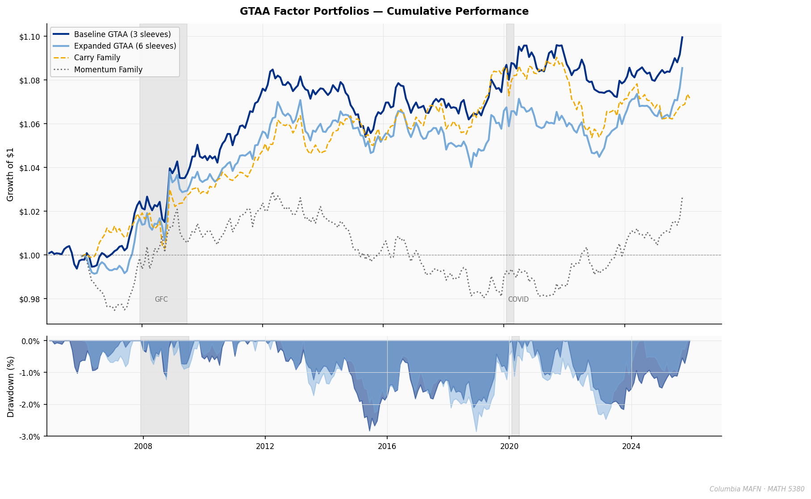

The key takeaway from the top-level cumulative chart is that the expanded strategy stays close to the baseline in realized performance and drawdown even though it introduces more sleeves and a wider macro opportunity set.

---

## 2. Inputs and Investment Universe

The final implementation uses monthly data and monthly portfolio updates. The expanded live sample runs from **December 2005 to November 2025** after applying the required signal and covariance lookbacks.

| Sleeve | Assets | Signal | Source |
|---|---|---|---|
| Equity Momentum | 10 country ETFs | 12-1 momentum from returns | provided country-equity series / Yahoo-aligned ETF returns |
| Commodity Momentum | 12 commodity ETFs | 12-1 momentum from prices | Yahoo Finance |
| Fixed-Income Momentum | 10 bond ETFs | 12-1 momentum from returns | Yahoo Finance |
| FX Momentum | 6 currency ETFs | 12-1 momentum from prices | Yahoo Finance |
| Fixed-Income Carry | 10 bond ETFs | yield-proxy carry | FRED + ETF return panel |
| FX Carry | 6 currency ETFs | foreign 3M rate minus USD 3M rate | FRED + FX ETF return panel |

The final universe spans equities, commodities, fixed income, and currencies, making the portfolio a genuine cross-asset GTAA process rather than a narrow equity-bond extension.

Data loading, cleaning, and alignment are documented directly in [notebooks/FINAL_SUBMISSION.ipynb](notebooks/FINAL_SUBMISSION.ipynb), including date parsing, numeric coercion, missing-value treatment, and the partial-universe alignment logic used by the covariance and volatility-scaling steps.

---

## 3. Submission Architecture and Monthly Construction Process

The final submitted model is the **expanded six-sleeve strategy**:

- **Cross-Asset Momentum**: equity momentum, commodity momentum, fixed-income momentum, FX momentum
- **Cross-Asset Carry**: fixed-income carry, FX carry

| Factor family | Sleeve implementation | Construction |
|---|---|---|
| Cross-Asset Momentum | Equity, Commodity, Fixed-Income, FX Momentum | rank-standardized long/short weights from 12-1 signals |
| Cross-Asset Carry | Fixed-Income Carry, FX Carry | rank-standardized long/short weights from carry signals |

The original three-sleeve strategy remains useful as a benchmark because it provides a cleaner low-dimensional reference point. The economic case for the expanded version is that it brings the portfolio closer to a genuine GTAA process by allocating across all the main macro sleeves constructed in the project, rather than stopping with the narrower baseline.

Operationally, the monthly construction process is:

1. Compute sleeve signals using only information available at month-end `t`.
2. Convert each sleeve signal into cross-sectional rank-standardized raw weights.
3. Estimate a 36-month population covariance matrix at each month-end.
4. Scale each sleeve to target 1% annualized ex-ante volatility.
5. Equal-weight sleeves within each factor family and rescale each family to 1%.
6. Equal-weight the two factor families and rescale the final portfolio again to 1%.
7. Apply weights formed at month `t` to returns realized at month `t+1`.

This satisfies the project’s core construction requirements: at least monthly re-estimation, at least 36 months of prior returns in the covariance matrix, sleeve-level 1% scaling, and final portfolio 1% scaling.

This step-by-step structure matters because it keeps the portfolio economically interpretable. The final strategy is not just a pool of raw signals; it is a hierarchical construction that preserves sleeve-level meaning while targeting comparable ex-ante risk across families.

---

## 4. Baseline vs Expanded Comparison

### Headline comparison

| Strategy | Live sample | Months | Ann. return | Ann. vol | IR | Avg DD | Max DD | Ann. turnover |
|---|---|---:|---:|---:|---:|---:|---:|---:|
| Baseline GTAA | Nov 2004 – Nov 2025 | 253 | **0.46%** | **1.06%** | **0.431** | -0.99% | **-2.83%** | 167.6% |
| Expanded GTAA | Dec 2005 – Nov 2025 | 240 | 0.42% | 1.15% | 0.361 | -1.01% | -2.86% | 236.3% |

The baseline is better on raw in-sample efficiency, but the expanded strategy is more faithful to a true cross-asset GTAA design. It broadens the portfolio across bonds and currencies while keeping maximum drawdown almost unchanged. The project is graded on the soundness of assumptions and methodology rather than on maximizing in-sample performance, so the expanded design is defensible even though it does not dominate the benchmark on information ratio.

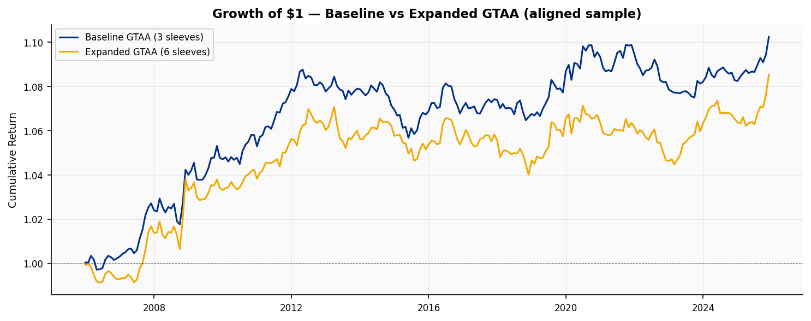

The growth comparison shows that the expanded model does not dominate the baseline, but neither does it introduce a materially worse path. The change is best understood as an architectural broadening rather than a pure performance upgrade.

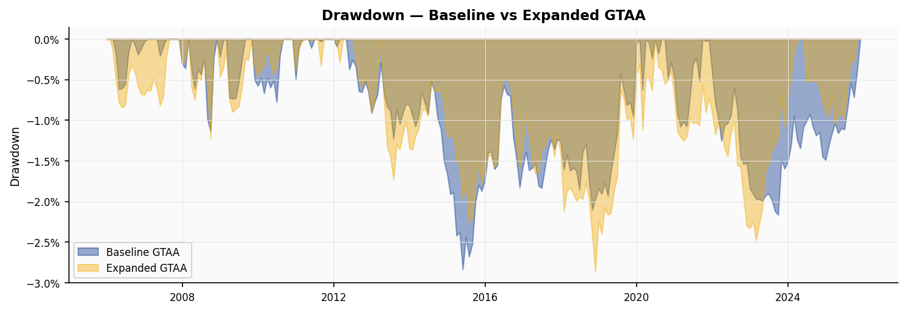

The drawdown comparison reinforces the most defensible justification for the expanded version: a more diversified macro opportunity set with almost the same downside profile.

---

## 5. Final Expanded Portfolio Results

The expanded strategy has **240 realized monthly returns** from **December 2005 to November 2025**.

| Strategy | Months | Ann. return | Ann. vol | Information ratio | Avg drawdown | Max drawdown | Annualized turnover |
|---|---:|---:|---:|---:|---:|---:|---:|
| Expanded GTAA (6 sleeves) | 240 | **0.42%** | **1.15%** | **0.361** | **-1.01%** | **-2.86%** | **236.3%** |

Within the expanded strategy, the carry family is the cleaner contributor, with an information ratio of 0.326 versus 0.124 for the momentum family. The weaker sleeves are fixed-income momentum and FX carry, which explains the lower final information ratio relative to the baseline benchmark.

*Source figure: [outputs/figures/cu_hero_cumulative.png](outputs/figures/cu_hero_cumulative.png).*

This figure shows the growth of $1 for the final portfolio and the benchmark comparison, together with the realized drawdown profile. The expanded strategy remains close to the baseline in cumulative performance and exhibits a similar maximum drawdown.

---

## 6. Sleeve-Level Findings

### Sleeve statistics

| Sleeve | Ann. return | Ann. vol | IR | Max DD | Interpretation |
|---|---:|---:|---:|---:|---|
| Equity Momentum | 0.40% | 1.08% | 0.374 | -5.00% | strongest momentum sleeve and the most consistent contributor |
| Commodity Momentum | 0.14% | 0.97% | 0.144 | -4.39% | cyclical contributor, strongest in commodity-trend windows |
| Fixed-Income Momentum | -0.07% | 0.99% | -0.075 | -4.96% | clear detractor over this sample |
| FX Momentum | 0.02% | 0.87% | 0.027 | -3.43% | close to flat, with short bursts of usefulness |
| Fixed-Income Carry | 0.13% | 0.58% | 0.217 | -4.21% | the cleanest individual carry sleeve |
| FX Carry | -0.01% | 0.87% | -0.012 | -4.13% | weakest carry sleeve over the sample |

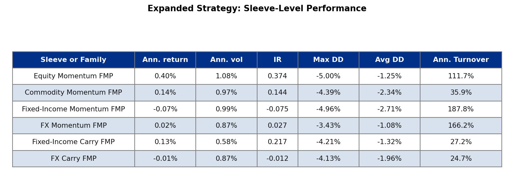

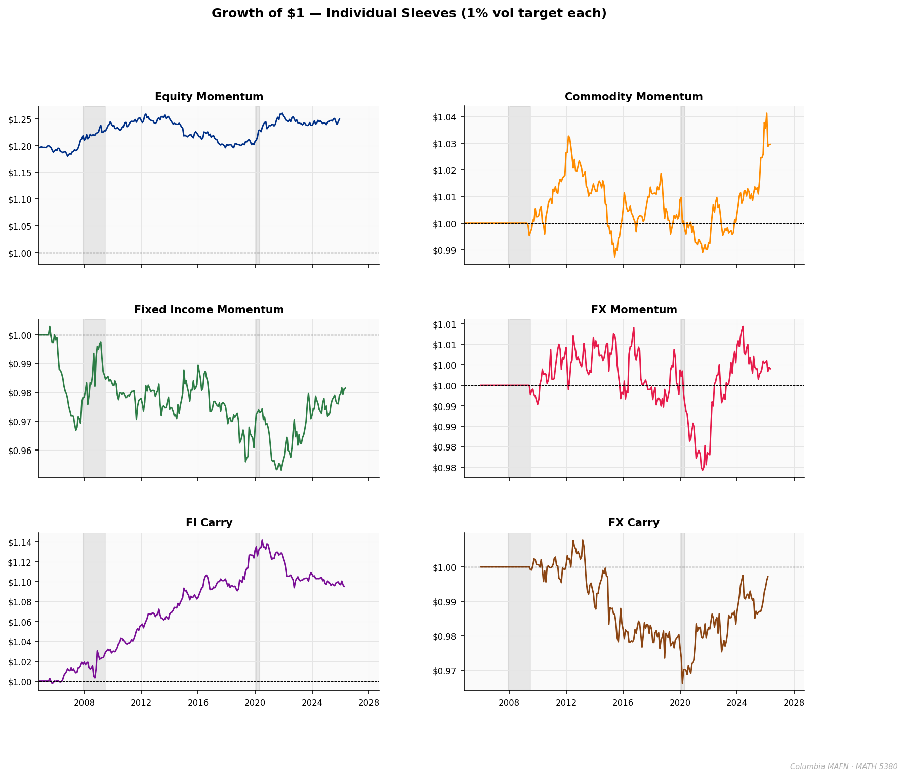

*Source figure: [outputs/figures/expanded_sleeve_growth.png](outputs/figures/expanded_sleeve_growth.png).*

The sleeve-level growth charts address the project requirement to show growth of $1 for each factor-mimicking portfolio separately. They also show the practical difference between the two families. Equity momentum and fixed-income carry do most of the heavy lifting, while fixed-income momentum and FX carry are the main reasons the final expanded information ratio falls short of the baseline.

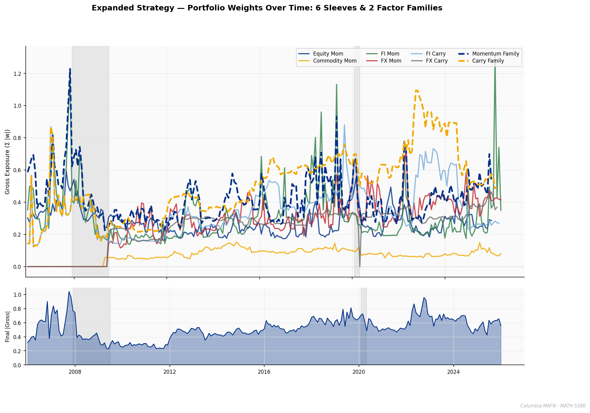

Looking at the sleeves and families together makes the trade-off even clearer. The carry family is not spectacular in raw return terms, but it is cleaner than the momentum family over this sample, and it helps stabilize the overall expanded portfolio when some momentum sleeves struggle simultaneously.

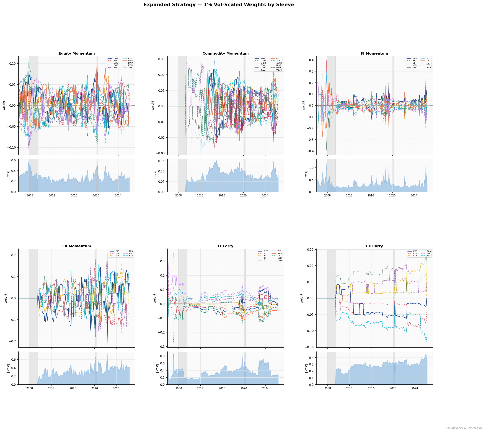

The sleeve weight panels show that momentum is materially more reactive than carry. Cross-sectional positions compress after volatility spikes and widen when dispersion increases, especially during the GFC and the 2020 shock window.

---

## 7. Family-Level Findings

### Family statistics

| Family | Ann. return | Ann. vol | IR | Max DD | Role |
|---|---:|---:|---:|---:|---|
| Cross-Asset Momentum | 0.13% | 1.09% | 0.124 | -4.72% | broad directional and cross-sectional macro expression |
| Cross-Asset Carry | 0.35% | 1.06% | 0.326 | -3.36% | cleaner and more stable contributor |

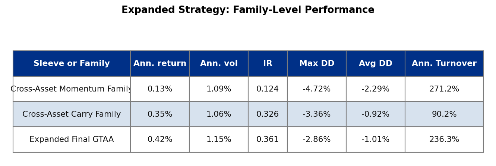

The carry family is the stronger contributor because the fixed-income carry sleeve behaves much more reliably than the weaker momentum and FX carry sleeves. The final expanded portfolio is therefore best interpreted as a balanced combination of a noisy momentum block and a steadier carry block.

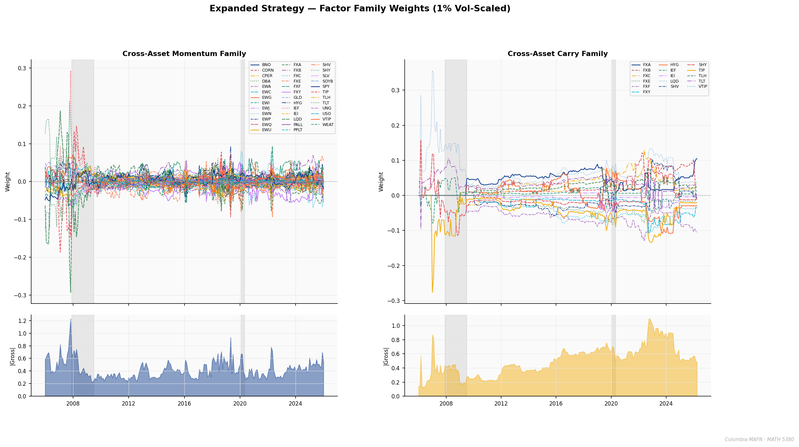

The family-weight panels show a clear difference in behavior:

- momentum rotates more aggressively and clusters near zero outside stressed periods
- carry builds more persistent long/short tilts and supports a steadier gross exposure profile

---

## 8. Weight Construction and Allocation Detail

The expanded architecture is easier to understand when we separate the raw cross-sectional signal expression from the volatility-scaled implementation.

### 8.1 Question 6.1 — Raw Factor Weights

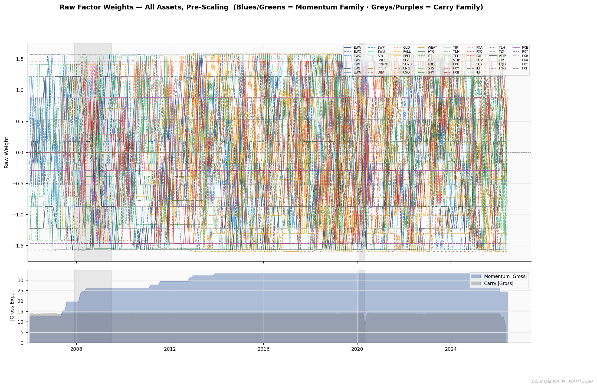

The raw factor weights reflect the pure ranking logic within each sleeve before any risk normalization. The main point from this panel is that the momentum block is structurally larger in raw gross terms than the carry block once the full cross-section is active. Momentum gross exposure rises from the mid-teens early in the sample to the low-30s after the universe fills out, while carry gross exposure stays much flatter around the low-to-mid teens. This is why the sleeve and family volatility-scaling steps are not cosmetic: without them, the broader momentum complex would dominate the final portfolio mechanically.

### 8.2 Question 6.2 — Factor 1 and Factor 2 1% Volatility Weights

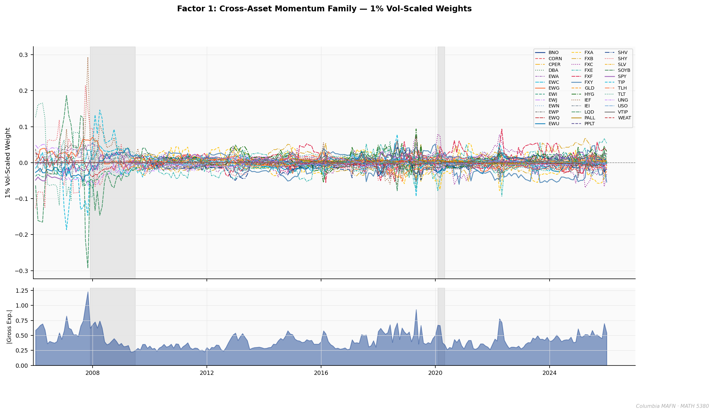

The momentum family panel shows a noisy and reactive book. Exposures compress toward zero through calm periods and then widen sharply around stress windows, especially during the GFC, the 2018–2020 interval, and parts of the 2022–2025 period. Even after scaling to a 1% target, the family-level gross exposure still moves materially because the underlying cross-sectional dispersion and covariance structure are changing over time.

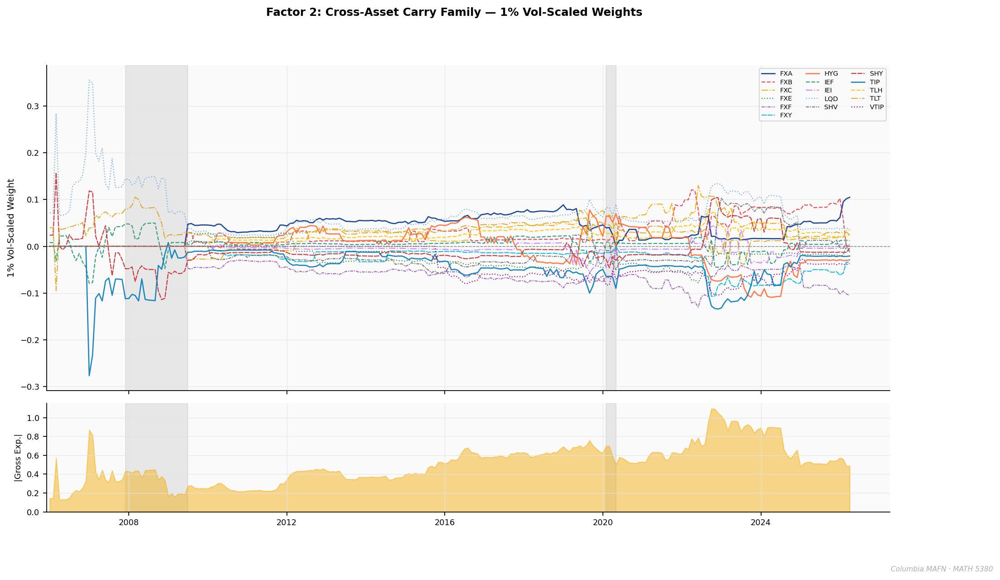

The carry family is much steadier. Its positions evolve in longer swings and the gross exposure profile trends upward more gradually, peaking much later in the sample. This matches the economics of the signals: carry is a slower-moving relative-value book, while momentum reacts more quickly to changing return dispersion. Together, the two Q6 family panels show why the final portfolio is best thought of as a mix of a faster, noisier momentum engine and a slower, more persistent carry engine.

### 8.3 Question 6.3 — Final 1% Volatility Portfolio Weights

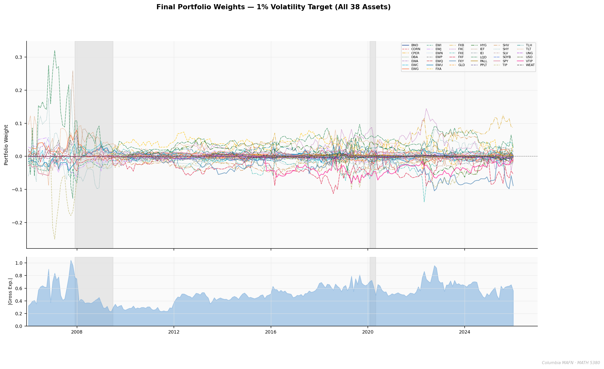

At the final portfolio level, the combined book is much more tightly centered than the raw or family-level panels. Gross exposure still rises during stressed periods, but the allocation remains spread across asset classes rather than collapsing into one dominant sleeve. This is the clearest visual evidence that the hierarchical scaling works as intended: the portfolio remains diversified across equities, commodities, bonds, and FX even when individual family books become more aggressive.

The final allocation process therefore has three layers of interpretation:

- raw weights tell us what the factor wants to own or short
- scaled family weights show what survives after risk normalization
- family and final weights show how those normalized sleeves interact inside the broader GTAA architecture

---

## 9. Portfolio Construction and No-Look-Ahead Controls

Look-ahead bias is explicitly controlled throughout the pipeline.

| Control | Implementation |
|---|---|
| Signal timing | momentum skips the most recent month |
| Covariance timing | covariance uses only trailing data available through month `t` |
| Return alignment | weights at `t` are applied to returns at `t+1` |
| Audit | dedicated verification notebook checks timing, alignment, carry pass-through, and future-shock invariance |

The expanded submission notebook and the dedicated audit notebook jointly cover the core implementation requirements:

1. signals are formed using only data available at month-end `t`
2. raw factor weights are rank-standardized cross-sections
3. covariance is estimated from a 36-month trailing window using `ddof=0`
4. each sleeve is scaled to a 1% annualized ex-ante volatility target
5. family portfolios are formed and rescaled to 1%
6. final portfolio weights formed at `t` earn returns at `t+1`

### 9.1 No-Look-Ahead Tests Run

The dedicated audit notebook runs six direct timing checks against the expanded
submission:

1. **Return-based momentum timing.** Equity and fixed-income momentum at date
   `t` use returns from `t-12` through `t-2` only.
2. **Price-based momentum timing.** Commodity and FX momentum at date `t` use
   `P_(t-13)` and `P_(t-2)` only.
3. **Covariance window integrity.** The 36-month annualised covariance matrix
   at `t` is built from `returns.loc[:t].tail(36)` and therefore excludes
   month `t+1`.
4. **Carry pass-through.** The carry sleeves use contemporaneous carry-signal
   sheets only; they do not pull information forward from future months.
5. **Final portfolio alignment.** Portfolio weights formed at `t` are applied
   to returns at `t+1`, matching the no-look-ahead backtest convention used
   throughout the project.
6. **Future-shock contamination test.** The source panels are shocked at
   `t+1`, the full expanded pipeline is rebuilt, and the family and final
   weights at `t` are confirmed to remain unchanged.

In addition to the notebook audit, we ran the targeted automated timing suite
locally:

- `tests/test_expanded_no_lookahead.py`
- `tests/test_no_lookahead_signals.py`
- `tests/test_no_lookahead_covariance.py`
- `tests/test_no_lookahead_portfolio_returns.py`

That verification pass completed cleanly with **15 / 15 tests passing**, and
both submitted notebooks were executed locally from a fresh `nbconvert`
run before finalising the repository.

The explicit no-look-ahead audit is here: [notebooks/09_no_lookahead_verification.ipynb](notebooks/09_no_lookahead_verification.ipynb).

Supporting files include [config/project2_gtaa_expanded.yaml](config/project2_gtaa_expanded.yaml) and [src/gtaa/portfolio/backtester_gtaa_expanded.py](src/gtaa/portfolio/backtester_gtaa_expanded.py).

The important practical result is not just that the code uses lagged signals and forward return alignment, but that the expanded family and final portfolio weights are invariant to shocks inserted at `t+1`. That makes the audit relevant to the actual submitted strategy rather than only to the older baseline notebook.

---

## 10. Risk, Turnover, and Correlation Takeaways

### 10.1 Question 7.1 — Final Covariance Matrix, November 2025

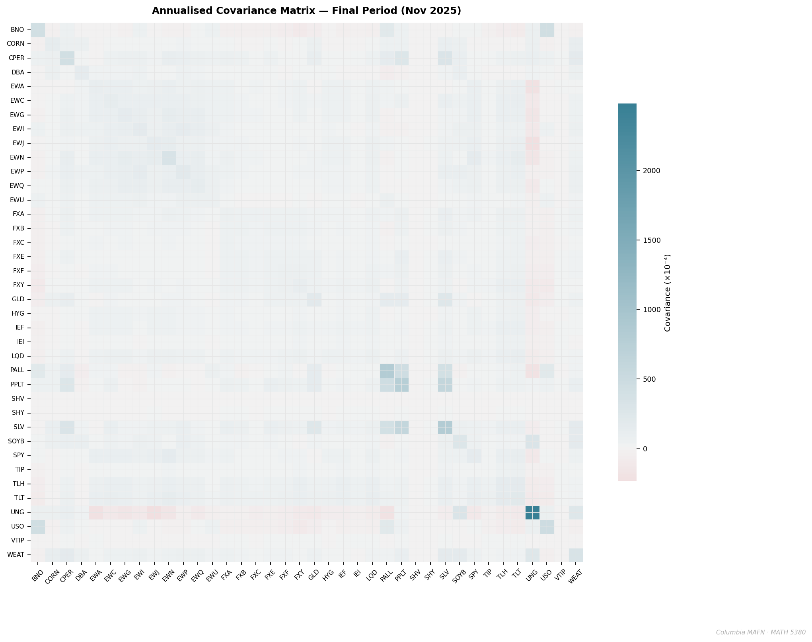

The November 2025 covariance matrix shows why scaling is important in this universe. The diagonal is visibly strongest in parts of the commodity block, especially the more volatile contracts and ETFs, while most cross-asset off-diagonal terms are modest by comparison. In practical terms, the portfolio does not need strong negative correlations to diversify well; it gets a large part of its diversification benefit simply from combining sleeves whose largest risks do not all sit in the same part of the matrix.

### 10.2 Question 7.2 — Final Asset Volatilities

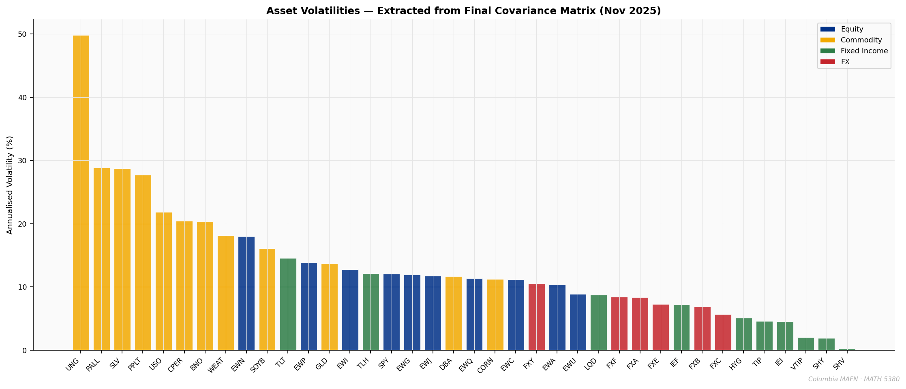

The final-period volatility ranking makes the same point more directly. Commodity names dominate the top of the distribution, with `UNG` far above the rest and precious-metals or commodity exposures also elevated. By contrast, much of fixed income sits at the low end of the scale, while FX mostly lands in the middle. This is exactly the setting where risk scaling changes the portfolio in economically meaningful ways: a raw long/short book would over-allocate to the highest-volatility commodity names unless the covariance-based normalization pushes them back down.

### 10.3 Question 7.3 — Final Correlation Matrix

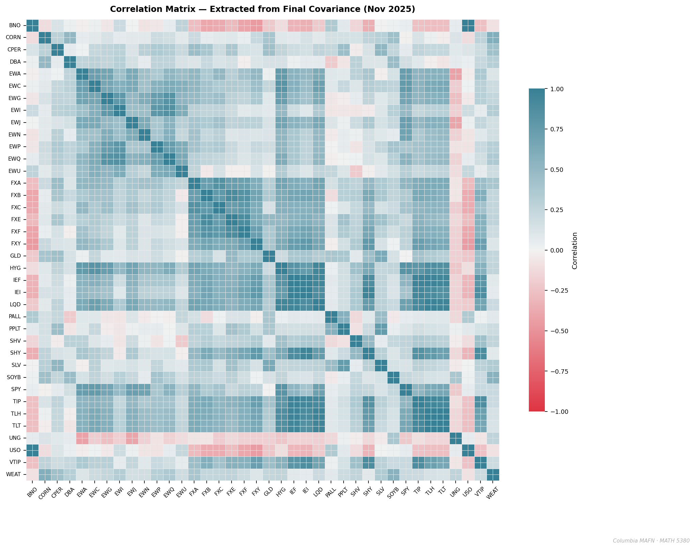

The correlation matrix shows distinct within-class blocks rather than one uniform market mode. Equity ETFs form a clear positive cluster, duration-heavy Treasury instruments also move together strongly, and the FX sleeve has its own coherent block. Commodities are more mixed, which is useful because it means the commodity complex contributes dispersion rather than just duplicate beta. Taken together with the covariance and volatility plots, this is the strongest final-period justification for the expanded architecture: the universe is broad enough that the portfolio can combine heterogeneous risk levels with non-uniform correlation structure instead of leaning on one narrow source of diversification.

### 10.4 Cross-Asset Diversification

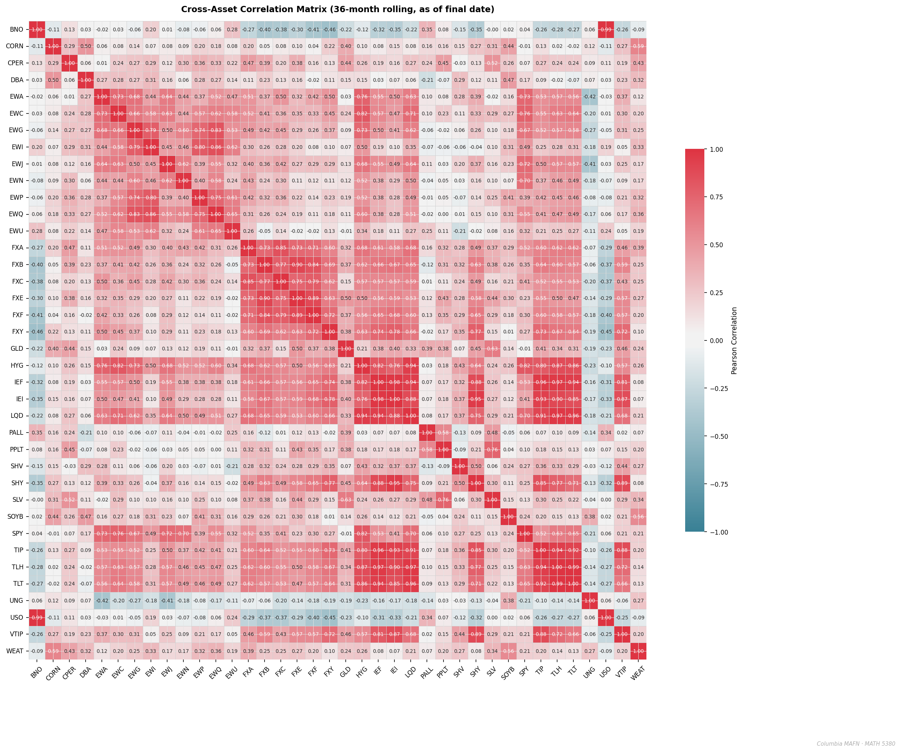

The correlation heatmap is the best direct justification for the expanded architecture. The sleeve set is not better simply because it is bigger; it is better because it introduces structurally distinct return sources that can offset each other during different macro windows. The Q7 matrix above makes that point at the final rebalance date, while this broader heatmap shows the same intuition at the sleeve and asset-class level more generally.

### 10.5 Turnover Cost of the Expansion

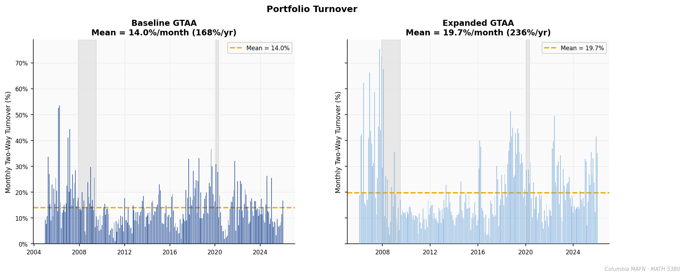

The main cost of the expanded specification is higher turnover. More sleeves mean more moving parts, more time-varying gross exposure, and more opportunities for volatility targeting to rescale the portfolio. That is a real trade-off: the expanded version is broader and more diversified, but operationally more active.

---

## 11. Notebook Deliverables Map

All required charts are embedded in [notebooks/FINAL_SUBMISSION.ipynb](notebooks/FINAL_SUBMISSION.ipynb). The table below maps the assignment requirements directly to notebook sections.

| Assignment requirement | Notebook location |
|---|---|
| Data used / data handling | `FINAL_SUBMISSION.ipynb`, Sections 1–3 |
| Factors / methodology | `FINAL_SUBMISSION.ipynb`, Sections 4–7 |
| Raw Factor Weights | `FINAL_SUBMISSION.ipynb`, Section 5 |
| Factor 1 1% Volatility Weights | `FINAL_SUBMISSION.ipynb`, Section 8 |
| Factor 2 1% Volatility Weights | `FINAL_SUBMISSION.ipynb`, Section 9 |
| Final 1% Volatility Portfolio Weights | `FINAL_SUBMISSION.ipynb`, Section 10 |
| Gross Returns / Growth of $1 | `FINAL_SUBMISSION.ipynb`, Section 11 |
| Portfolio Statistics | `FINAL_SUBMISSION.ipynb`, Section 12 |
| Turnover | `FINAL_SUBMISSION.ipynb`, Section 13 |
| Covariances / Volatilities / Correlations | `FINAL_SUBMISSION.ipynb`, Section 14 |
| No-look-ahead audit | `09_no_lookahead_verification.ipynb` |

The final notebook also renders the numeric final-period covariance and correlation matrices directly beneath the heatmaps, so the matrix requirement is met in both chart and tabular form.

---

## 12. Methodology Notes That Matter

Several implementation choices are worth emphasizing because they affect how the results should be read:

- **Signals are ranked only within sleeves.** FX carry, bond carry, commodity momentum, and equity momentum are not pooled into one raw cross-section because those signals live in different economic units.
- **The covariance estimator uses `ddof=0`.** This matches the assignment’s population-covariance framing and is applied consistently in the final notebook.
- **Weights formed at `t` earn returns at `t+1`.** This is not only a conceptual statement; it is enforced in the portfolio return construction and verified in the audit notebook.
- **The expanded sample begins later than the baseline.** This is a data-availability consequence of the FX sleeves and should not be interpreted as a modeling inconsistency.
- **Returns are now reported using arithmetic annualized simple returns.** This is the convention stated in the project brief and makes the final notebook and this document aligned with the rubric.

---

## 13. Limitations

### 13.1 Study Scope and Data Snooping

All reported statistics are derived from a single historical backtest with no out-of-sample or walk-forward test conducted. This means performance statistics, especially the information ratio, may be upwardly biased due to implicit data-snooping involved in choosing the universe, signal lookbacks, covariance windows, and aggregation weights. No transaction costs were modelled in the headline backtest, though an example with costs is available in the code repository.

### 13.2 Implementation Reality vs Backtest

ETF-level implementation was used as a proxy, but in reality, returns incorporate fund expenses, tracking error, and occasional liquidity constraints not present in the underlying futures contracts used by institutional GTAA managers. This is especially relevant for commodity ETFs. For example, USO has rolling costs not fully captured in the adjusted price series, creating a persistent drag on returns that the backtest may not fully isolate.

### 13.3 Universe Composition and Data Availability

Several ETFs in the universe have short availability windows that begin mid-backtest. The partial-universe approach handles this mechanically, but the composition of the commodity sleeve changes over time, potentially biasing early-period results. Additionally, FX signal quality is questionable, as FX momentum and FX carry strategies produce near-zero or negative information ratios. This raises the question of whether they add long-run value or simply add noise.

### 13.4 Parameter Sensitivity

The 12-1 momentum lookback, 36-month rolling covariance window, and equal sleeve/family weighting scheme are fixed throughout the backtest. Sensitivity to these choices has not been tested. A more robust implementation would check stability across reasonable parameter ranges to ensure the strategy is not fragile to small deviations in these hyperparameters.

---

## 14. Sources and Submission Files

- Assignment brief: [docs/Project 2 .pdf](docs/Project%202%20.pdf)
- Final submission notebook: [notebooks/FINAL_SUBMISSION.ipynb](notebooks/FINAL_SUBMISSION.ipynb)
- No-look-ahead audit: [notebooks/09_no_lookahead_verification.ipynb](notebooks/09_no_lookahead_verification.ipynb)
- Submission notebook builder: [scripts/build_final_submission_notebook.py](scripts/build_final_submission_notebook.py)
- Audit notebook builder: [scripts/build_no_lookahead_notebook.py](scripts/build_no_lookahead_notebook.py)
- Expanded config: [config/project2_gtaa_expanded.yaml](config/project2_gtaa_expanded.yaml)
- Raw input data workbook: [data/raw/multi_asset_universe.xlsx](data/raw/multi_asset_universe.xlsx)
- Code entry points: [src/gtaa/portfolio/backtester_gtaa_expanded.py](src/gtaa/portfolio/backtester_gtaa_expanded.py), [scripts/generate_visualizations.py](scripts/generate_visualizations.py)

*Prepared from the repository outputs as of 2026-05-08.*

---

## 15. Bottom Line

The most honest summary is:

- the **baseline** is the stronger in-sample benchmark
- the **expanded** strategy is the stronger GTAA architecture
- the best justification for the expanded version is broader cross-asset diversification with nearly unchanged drawdown, not superior backtest information ratio

That makes the final submission defensible on the criteria the assignment emphasizes: clarity of construction, rigor of methodology, complete deliverables, and clean control of look-ahead bias.
